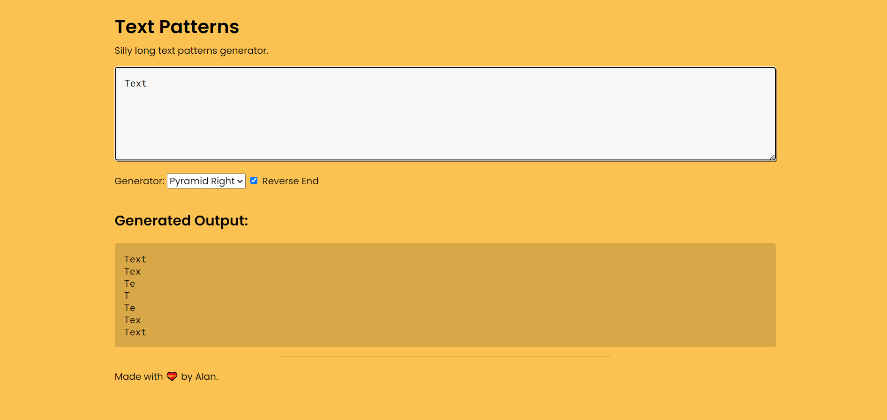

# 🔶 TextWeave 

    

## [Demo](https://waterrmalann.github.io/textweave/)   |   [Source](https://github.com/waterrmalann/textweave/blob/main/js/main.js)

A web app that takes an input text and generates lines that resemble a pattern like a pyramid, diamond, etc. This tiny project was written in HTML, CSS, and vanilla JavaScript.

**An example of a pattern generated using TextWeave.**

```
T
Te
Tex
Text
TextW
TextWe
TextWea
TextWeav
TextWeave
TextWeav
TextWea
TextWe
TextW
Text
Tex
Te
T
```

Fonts from [Google Fonts](https://fonts.google.com/).



---

### 🚀 Setup

A live and up-to-date version of the web app is available [here](https://waterrmalann.github.io/textweave/). If you wish to modify the app or host it yourself, you can clone the repo and do whatever you want with it.

1. [Clone the repository](https://docs.github.com/en/github/creating-cloning-and-archiving-repositories/cloning-a-repository-from-github/cloning-a-repository).

```sh
git clone https://github.com/waterrmalann/textweave.git
```

2. Install the dependencies.

```sh
npm install
```

3. This will start a live server. Head to the IP shown in the console.

```sh
npm run serve
```

---

### 🤝 Contribution

Contributions are always accepted. Feel free to open a pull request to fix any issues or to make improvements you think that should be made. You could also help me with the to-do list above. Any contribution will be accepted as long as it doesn't stray too much from the objective of the app. If you're in doubt about whether the PR would be accepted or not, you can always open an issue to get my opinion on it.

License
----

This project is licensed under the permissive **MIT License**, see [LICENSE](LICENSE)
